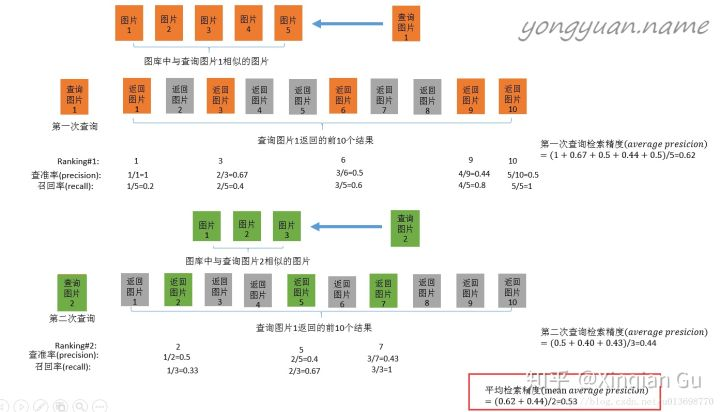
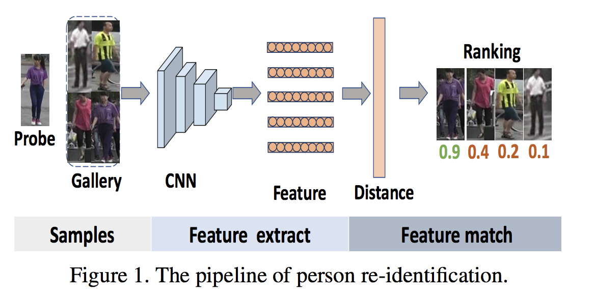

1.ReID与人脸识别有什么联系和区别？

都是多媒体内容检索，从方法论来说是通用的；但是ReID相比行人更有挑战，跨摄像头场景下复杂姿态，严重遮挡，多变的光照条件等等。

2.做ReID的话，一般从两方面入手：

A、特征工程，设计网络来学习不同场景下都general的visual feature，用probe-gallery的特征相关性来作为ranking的依据，一般直接Softmax分类。

B、度量学习，设计损失函数，用多张图像的label来约束它们特征之间的关系，使学到的特征尽量类内间隔短，类间间隔大。

3.行人重识别re-ranking的原理？

4.根据我目前浅显的调研，行人重识别任务基本思路可以分为两类：

Metric Learning，针对两张图片之间相似性度量的学习，转化为验证问题

Classification Learning，将不同实体的行人作为不同类别，转化为分类问题

最新的方法大都会将两种思路结合起来。在此基础上针对各种细节，包括特征对齐、人体区域划分、全局与局部特征、 损失函数等方向进行优化。

5.Re-ID的思路和方向？

大致的方法可以归纳为：

* 1.Triplet 方法进行 end-to-end 的度量学习；

* 2.整体和 Part 模型的结合，聚焦在 Part Model 的 Alignment 上，比如 STN、FCN网络来做 Part 定位；

* 3.Attention Model（注意力模型） 提取 Key frame（关键帧）；

* 4.Video-based 方向，通过 Two-Stream方法 or C3D 做序列比对；

* 5.非监督学习方法；

6.如何在火热的行人重识别中寻找基于视频的重识别的新idea?

基于视频的方法思路比较多，比如Two Stream系列的方法,conv3D系列方法，再比如通过加入目标的跟踪，获取目标的多帧信息（考虑加权），都是比较好的思路！

另外，可以考虑通过强化学习的方法来做一些判断，具体可以参考一些论文信息！

行人重识别前沿算法

7.行人重识别之中mAP（平均准确率）到底怎么算？

行人重识别之中mAP（平均准确率）也就是说multi-shot experiments （gallery中同一个人有多张照片）。此时的map的计算原理是什么？

放一张之前收藏的图解释retrieval任务中的mAP计算方式。此外在一些reid的源码中还会看到在计算mAP和CMC之前将与probe img 同ID(identity)的gallery img去掉。这是为了遵循reid任务主要是cross view 匹配的定义。

8.Introduction to Information Retrieval Evaluation 

9.行人重识别中的multi-query是什么？

* 1.multi-query 是用多个query来做图像检索的方式，相比使用单张图像single-query来检索 有更高的准确度和鲁棒性。

* 2.目前行人重识别中 使用的是 在同一个摄像头下，同一个行人 tracking list的后几张图作为额外的query来补充。构成多multiple queries。

* 3.实际采用的做法，最常见的是将每张图像提出的特征取平均。

* 4.Re-ranking实际也很接近multi-query，利用了更多图像的特征。但不同点是re-ranking主要将第一次rank排名高的图像（在候选图像库中）加入了考虑。而不是额外标注的ground-truth图像。

10.The pipeline of person re-identification.

A typical pipeline of deep feature based re-ID consists of two steps: feature extract and feature match. It first utilizes a part of the well-trained network as a feature extractor and then uses a certain distance metric such as Euclidean distance for person retrieval (see Fig. 1). Images with high enough score are considered as positives.

