# 1.基本概念
reid问题可以分成两类：open set Re-ID and closed set Re-ID.

A Re-ID system is similar to a recognition system, which comprises of a gallery set (set of known people) and the probe (unknown person) on which the recognition has to be performed. Fig. 4 depicts the Re-ID system setup as a recognition system.

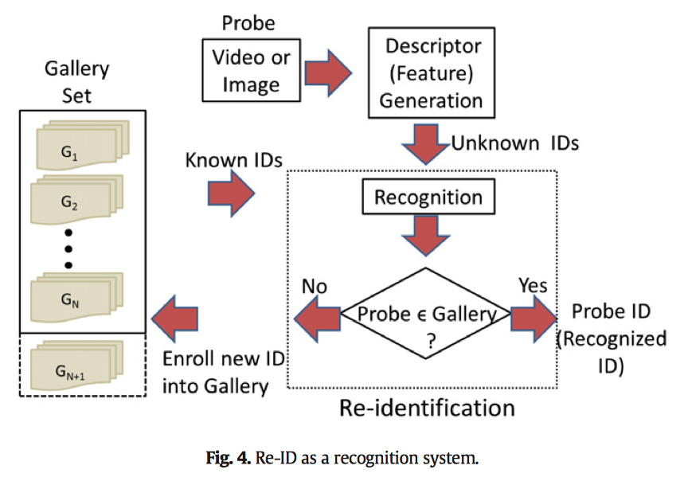

Let the gallery set be represented as $G = \left( g _ { 1 } , g _ { 2 } , \dots , g _ { N } \right)$. Thus, the set of known IDs is given by $i d ( G ) = \left( i d \left( g _ { 1 } \right) , i d \left( g _ { 2 } \right) , \ldots , i d \left( g _ { N } \right) \right)$, where the function id(.) specifies the ID assigned to its argument. Let $P=\left( p _ { 1 } , p _ { 2 } , \dots , p _ { M } \right)$ represent the probe set, which means that the set of unknown IDs is given by $i d ( P ) = \left( i d \left( p _ { 1 } \right) , i d \left( p _ { 2 } \right) , \ldots , i d \left( p _ { M } \right) \right)$. Typically in a recognition framework, when the probe is presented to the system, it is compared to each gallery and similarity measures are computed. The gallery is ranked using the similarity in order to determine the probe ID. The same setup applies to the problem of Re-ID. Closed set Re-ID is the scenario where the probe is a subset of the gallery, i.e. the probe ID exists in the gallery and the objective is to determine the true ID of the probe. Thus, given that $i d ( P ) \subseteq i d ( G )$, the true probe ID for a given probe $p _ { j }$ is $i d \left( p _ { j } \right) = i d \left( g _ { i } *\right )$, such that,

$i * = \underset { i \in 1 , \ldots , N } { \arg \operatorname { maxp } } \left( g _ { i } | p _ { j } \right)$     (1)

where,$p \left( g _ { i } | p _ { i } \right)$ is the likelihood that $i d \left( p _ { j } \right) = i d \left( g _ { i } \right)$ and is most often represented by a similarity measure. This implies that the top ranked gallery ID is assigned to the probe. In open set Re-ID on the other hand, the probe may or may not be a subset of the gallery. This implies the open set Re-ID objective is to first establish if the probe ID is a part of the gallery, and if so, determine the true probe ID. Thus, in order to find the true ID, in addition to ranking the gallery elements and determining $i *$ using Eq. 1, the following condition also needs to be satisfied,

$$p \left( g _ { i * } | p _ { j } \right) > \tau$$

In Eq. 2,$\tau$ is the acceptable level of certainty above which we can be reasonably assured that $i d \left( p _ { j } \right) \subseteq i d ( G )$). If this condition is not satisfied, then it is determined that the probe is not a part of the gallery. If so, the probe ID is then to be enrolled into the gallery. The process of deter- mining a previously unknown ID is called novelty detection. Similar to identification tasks, the closed set Re-ID is a constrained form of open set Re-ID. The Re-ID application dictates the matching scenario. For instance, to achieve consistent tracking over multiple cameras for global trajectory of a person over a camera network requires open set Re-ID. On the other hand, identity based retrieval (for forensic applications), i.e. the ability to identify multiple observations of a particular person is a closed set Re-ID problem.

gallery是候选行人库，probe是待查询输入，也叫查询图像（query），CMC是一种reid的性能评价方法，即Cumulative Match Characteristic。

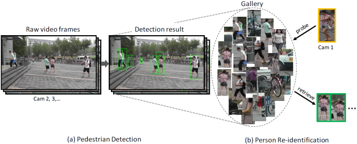

# 2.评价指标

## single-shot

each gallery identity has only one instance.（一个人在gallery中只有一张图片）。这种情况就是probe集合中，一个ID（一个人对应一个ID）可能会有多张instances，但是在gallery中，每个ID只有一个instance。而且测试的时候，同一个ID在probe和gallery中的instance必须是分别属于不同摄像头的，这样才满足跨摄像头检测的条件。即probe中ID可能有的多个instances，但必须全部属于A摄像头，在gallery中，同一ID的instance属于B摄像头。

## multi-shot

multi-shot: each gallery identity could have multiple instances（一个人在gallery中有多张图片）。

## reid的训练过程

假设数据库中有300个人，那么，训练集选取200个人，测试集就是剩下那100个人。两者人的id不交叉，数据集的划分一般由数据库决定，数据库官网或者发布数据库的文章会说明划分数据集的协议，就是多少人训练，多少人测试，确定人数之后，具体哪些训练和测试，一般由我们自己随机选取。

一般情况下，reid的数据库都是在两个摄像头或者两个以上的摄像头下进行拍摄的，以两个摄像头为例,随机选取一个摄像头下的测试的人的图片作为probe set，其他摄像头下的图片作为gallery set。

Q：就是说把剩下的这100个人（测试集），再分为probe set和gallery set两部分来测试？

A：是的，但是是根据摄像头来分，不是id来分

Q：一般一个摄像头会拍摄两张及以上的同一行人的图片，选择的时候，是一个摄像头拍的都选完吗？

A：选完（一般都是选完的，具体的要看数据库的说明）

Q：每测试一张probe set中的图片都要和gallery set中的每张图片计算一遍？

A：是的

Q：open set reid和closed set reid的不同就在于probe 不一定是gallery的子集（也可能是）？

A：是的

Q：在open set reid问题上，probe的图像在gallery中没有对应的目标时，这个时候返回的距离排序结果如何处理呢？

A：待解答

## Cumulative Matching Characteristics (CMC)

在reid中，CMC是一个最常用的评价指标。在single-shot这种模式下，在测试的时候，对于每次查询，算法会计算probe与gallery中所有图片的距离，然后由近到远排序，所以CMC top-k(also called rank-k) accuracy is:

$$A c c _ { k } = \left\{ \begin{array} { l l } { 1 } & { \text { if top-k ranked gallery samples contain the query identity } } \\ { 0 } & { \text { otherwise } } \end{array} \right.$$

which is a shifted step function. The final CMC curve is computed by averaging the shifted step functions over all the queries.

当k=1的时候，我们就称为第一匹配率，反映了最匹配候选目标刚好为待查询图片目标的概率，即该指标为真正的识别能力，因此很重要（一般的论文中只看k=1这个指标）。但是当 k 值很小但大于1时，由于可以通过人眼进行辅助识别查找目标，因此也很有现实意义，如第5匹配率 k=5 指标反映前 5 个匹配候选目标中存在待查询图片目标的概率。

同时，只看top-1也是有历史原因的，在早期，行人重识别数据集是由两个摄像头采集的比如viper，每个query只有一个正确的retrieval目标,这种时候使用top1是准确，要么你就能检索出来，要么你就检索不到。但在近期，随着大数据集的提出，数据集中往往包含多个摄像头的多个正确目标。光使用top1的话，不能反应模型的真实能力。所以类似图像检索，重识别加入了mAP作为衡量标准，将top2,top3...topn都考虑进去。

在multi-shot的时候，each gallery identity could have multiple instances，这种CMC评价指标就有点不合适了。因为当有多个instances时，两个有不同的 retrieval recall ability的模型可能在CMC top-1准确率都是一样的。这种情况下CMC就不能说明两个模型的不同能力了，因为我们认为一个好的reid系统，应该是能够返回与查询图像属于同一ID的所有图片的。所以就出现了mAP这个指标（the mean average precision）。

比如在 CUHK03 and Market-1501 中，计算  CMC 曲线 和 CMC top-k accuracy 就十分不同。具体如下：

&nbsp;&nbsp;&nbsp;&nbsp;CUHK03: Query and gallery sets are from different camera views. For each query, they randomly sample one instance for each gallery identity, and compute a CMC curve in the single-gallery-shot setting. The random sampling is repeated for NN times and the expected CMC curve is reported.

&nbsp;&nbsp;&nbsp;&nbsp;Market-1501: Query and gallery sets could have same camera views, but for each individual query identity, his/her gallery samples from the same camera are excluded. They do not randomly sample only one instance for each gallery identity. This means the query will always match the “easiest” positive sample in the gallery while does not care other harder positive samples when computing CMC.

# 损失函数

reid的训练模式与平时的分类任务很很大的不同，loss不能直接套过来使用。reid其实和人脸检测属于同一类任务，只是先验知识不同而已，很多东西都可以照搬过来。所以，loss也一样，reid任务中使用的loss很多都是直接从人脸检测上搬过来的。下面主要说人脸识别的loss（因为现在的reid就在用相同的loss函数）

## 人脸识别loss详解

### softmax

Softmax是soft（软化）的max。在CNN的分类问题中，我们的ground truth是one-hot形式，下面以四分类为例，理想输出应该是（1，0，0，0），或者说（100%，0%，0%，0%），这就是我们想让CNN学到的终极目标。网络输出的幅值千差万别，输出最大的那一路对应的就是我们需要的分类结果。通常用百分比形式计算分类置信度，最简单的方式就是计算输出占比，假设输出特征是$\left( x _ { 1 } , x _ { 2 } , x _ { 3 } , x _ { 4 } \right)$，这种最直接最最普通的方式，相对于soft的max，在这里我们把它叫做hard的max：

$$p = \frac { x _ { i } } { \sum _ { j } x _ { j } }$$

而现在通用的是soft的max，将每个输出x非线性放大到exp(x)，形式如下：

$$p = \frac { e ^ { x _ { i } } } { \sum _ { j } e ^ { x _ { j } } }$$

hard的max和soft的max到底有什么区别呢？看几个例子

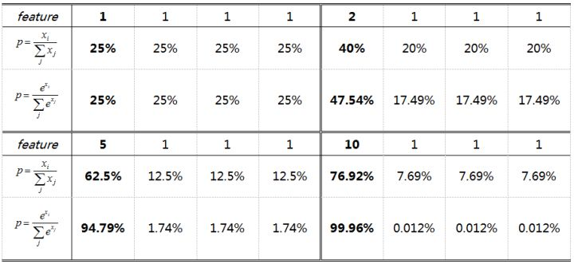

相同输出特征情况，soft max比hard max更容易达到终极目标one-hot形式，或者说，softmax降低了训练难度，使得多分类问题更容易收敛。

到底想说什么呢？Softmax鼓励真实目标类别输出比其他类别要大，但并不要求大很多。对于人脸识别的特征映射（feature embedding）来说，Softmax鼓励不同类别的特征分开，但并不鼓励特征分离很多，如上表（5，1，1，1）时loss就已经很小了，此时CNN接近收敛梯度不再下降。

Softmax Loss训练CNN，MNIST上10分类的2维特征映射可视化如下：

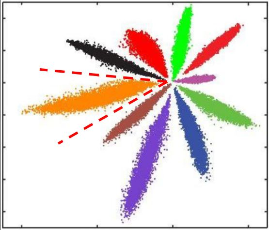

不同类别明显分开了，但这种情况并不满足我们人脸识别中特征向量对比的需求。人脸识别中特征向量相似度计算，常用欧式距离（L2 distance）和余弦距离（cosine distance），我们分别讨论这两种情况：

L2距离：L2距离越小，向量相似度越高。可能同类的特征向量距离（黄色）比不同类的特征向量距离（绿色）更大

cos距离：夹角越小，cos距离越大，向量相似度越高。可能同类的特征向量夹角（黄色）比不同类的特征向量夹角（绿色）更大

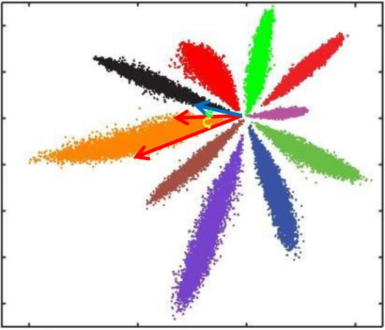

总结来说：

1.Softmax训练的深度特征，会把整个超空间或者超球，按照分类个数进行划分，保证类别是可分的，这一点对多分类任务如MNIST和ImageNet非常合适，因为测试类别必定在训练类别中。

2.但Softmax并不要求类内紧凑和类间分离，这一点非常不适合人脸识别任务，因为训练集的1W人数，相对测试集整个世界70亿人类来说，非常微不足道，而我们不可能拿到所有人的训练样本，更过分的是，一般我们还要求训练集和测试集不重叠。

3.所以需要改造Softmax，除了保证可分性外，还要做到特征向量类内尽可能紧凑，类间尽可能分离。

每个人为一类，总共n+1类。收敛后的网络可以用于提取待测试集合的人脸特征，再在该特征基础上训练分类器（SVM、联合贝叶斯、knn等）, 缺陷是区分力度不够，受限于close-set，对于open-set的泛化性不够。一般的解决办法如deepid是网络只用作提取特征，后续再接一个特定任务的分类器。

### 双约束的Loss Function

1.[Deep learning face representation by joint identification-verification,NIPS,2014.](https://arxiv.org/abs/1406.4773)

2.[Deeply learned face representations are sparse, selective, and robust,CVPR, 2015.](https://arxiv.org/pdf/1412.1265.pdf)

3.[Deepid3: Face recognition with very deep neural networks](https://arxiv.org/pdf/1502.00873.pdf)

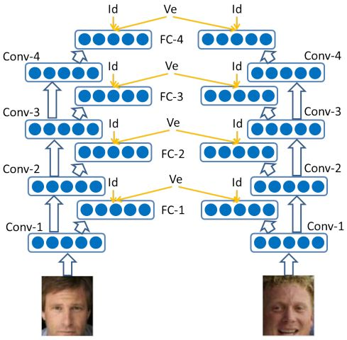

DeepID2, DeepID2+, DeepID3都在采用Softmax + Contrastive Loss，Contrast Loss是：

$$\operatorname { Verif } \left( f _ { i } , f _ { j } , y _ { i j } , \theta _ { v e } \right) = \left\{ \begin{array} { l } { \frac { 1 } { 2 } \left\| f _ { i } - f _ { j } \right\| _ { 2 } ^ { 2 } } \\ { \frac { 1 } { 2 } \max \left( 0 , m - \left\| f _ { i } - f _ { j } \right\| _ { 2 } \right) ^ { 2 } } & { \text { if } y _ { i j } = - 1 } \end{array} \right.$$



同类特征的L2距离尽可能小，不同类特征的L2距离大于margin(间隔) m（因为从loss函数可以看出，只有不同类的特征L2距离大于m，后面为负数，才会取到0，loss才会尽可能的小，不然总是取到比0大的数，对减小loss不利），Contrastive Loss同时约束类内紧凑和类间分离。

25个patch训练25个CNN，特征联合后PAC降维，训练Joint Bayesian分类，在LFW上Softmax + Contrast Loss的DeepID2达到99.15%，多层加监督信息的DeepID2+达到99.47，采用更大的deep CNN的DeepID3达到99.53%。DeepID系列是早期的深度学习人脸识别方法，但代码都没有开源，而且深度特征是多patch联合，还要训练分类器，繁琐不实用。

4.[Facenet: A unified embedding for face recognition and clustering,CVPR, 2015](https://arxiv.org/abs/1503.03832)

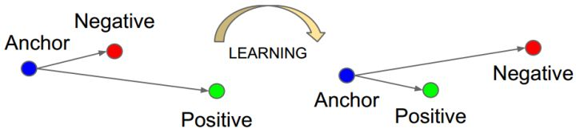

FaceNet是目前引用量最高的人脸识别方法，没有用Softmax，而是提出了Triple Loss：

$$\sum _ { i } ^ { N } \left[ \left\| f \left( x _ { i } ^ { a } \right) - f \left( x _ { i } ^ { p } \right) \right\| _ { 2 } ^ { 2 } - \left\| f \left( x _ { i } ^ { a } \right) - f \left( x _ { i } ^ { n } \right) \right\| _ { 2 } ^ { 2 } + \alpha \right] _ { + }$$

其中$(z)_{+}$ 表示 $max(z,0)$

以三元组（a, p, n）形式进行优化，不同类特征的L2距离要比同类特征的L2距离大margin m，同时获得类内紧凑和类间分离。FaceNet用200M训练数据，仅128维特征映射，在LFW上达到了99.63%，非常犀利。但代码、模型和训练数据集都没有开源，三元组选择极具技巧性，复现非常困难。好文推荐！

### Center Loss

参考论文：[A discriminative feature learning approach for deep face recognition](https://ydwen.github.io/papers/WenECCV16.pdf)

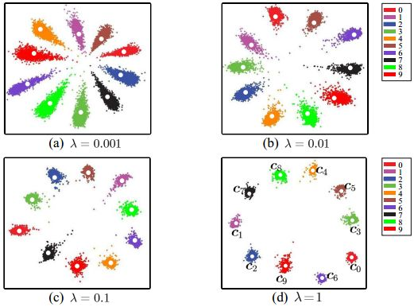

[Center Loss](https://github.com/ydwen/caffe-face)为每个类别学习一个中心，并将每个类别的所有特征向量拉向对应类别中心，联合Softmax一起使用：

$$\begin{aligned} \mathcal { L } & = \mathcal { L } _ { S } + \lambda \mathcal { L } _ { C } \\ & = - \sum _ { i = 1 } ^ { m } \log \frac { e ^ { W _ { y _ { i } } ^ { T } \boldsymbol { x } _ { i } + b _ { y _ { i } } } } { \sum _ { j = 1 } ^ { n } e ^ { W _ { j } ^ { T } \boldsymbol { x } _ { i } + b _ { j } } } + \frac { \lambda } { 2 } \sum _ { i = 1 } ^ { m } \left\| \boldsymbol { x } _ { i } - \boldsymbol { c } _ { y _ { i } } \right\| _ { 2 } ^ { 2 } \end{aligned}$$

Center Loss在Softmax的基础上，仅显式约束类内紧凑，0.7M训练数据7层CNN在LFW上达到了99.28，对照SphereFace论文，0.49M训练数据64层CNN在LFW上是99.05，在大型测试集MegaFace上也做到了small的SOTA。开源代码非常良心，但Center Loss为每个类别需要保留一个类别中心，当类别数量很多（>10000）时，这个内存消耗非常可观，对GPU的内存要求较高，而且这也导致caffemodel比较大。好文推荐！

由于类内紧凑约束用了L2距离，所以我觉得特征相似度度量应该用L2距离，但论文中用了cos距离，这一点有些疑惑（或许是我理解错了）。

### contrasive-loss

### 其他加约束loss

#### 1.Center Invariant Loss
#### 2.Range loss

## reid的loss详解（基于度量学习的ReID方法）

度量学习(Metric learning)是广泛用于图像检索领域的一种方法。不同于表征学习，度量学习旨在通过网络学习出两张图片的相似度。在行人重识别问题上，具体为同一行人的不同图片相似度大于不同行人的不同图片。最后网络的损失函数使得相同行人图片（正样本对）的距离尽可能小，不同行人图片（负样本对）的距离尽可能大。常用的度量学习损失方法有对比损失(Contrastive loss)[5]、三元组损失(Triplet loss)[6-8]、 四元组损失(Quadruplet loss)[9]、难样本采样三元组损失(Triplet hard loss with batch hard mining, TriHard loss)[10]、边界挖掘损失(Margin sample mining loss, MSML)[11]。

首先，假如有两张输入图片$I_{1}$和$I_{2}$，通过网络的前馈我们可以得到它们归一化后的特征向量$f _ { I _ { 1 } }$和$f _ { I _ { 2 } }$,我们定义这两张图片特征向量的欧式距离(L2距离)为：

$$d _ { I _ { 1 } , I _ { 2 } } = \left\| f _ { I _ { 1 } } - f _ { I _ { 2 } } \right\| _ { 2 }$$

### 1.对比损失(Contrastive loss)

参考：[Gated siamese convolutional neural network architecture for human re-identification](https://arxiv.org/abs/1607.08378)

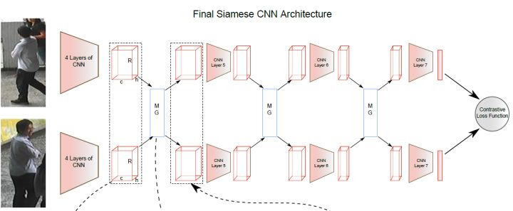

对比损失用于训练孪生网络(Siamese network)，其结构图如上图所示。孪生网络的输入为一对（两张）图片$I_{a}$和$I_{b}$，这两张图片可以为同一行人，也可以为不同行人。每一对训练图片都有一个标签$y$，其中$y=1$表示两张图片属于同一个行人（正样本对），反之$y=0$表示它们属于不同行人（负样本对）。之后，对比损失函数写作:

$$L _ { c } = y d _ { I _ { a } , I _ { b } } ^ { 2 } + ( 1 - y ) \left( \alpha - d _ { I _ { a } , I _ { b } } \right) _ { + } ^ { 2 }$$

$\alpha$是根据实际需求设计的阈值参数(相当于人脸loss中说的m)。为了最小化损失函数，当网络输入一对正样本对，$d \left( I _ { a }  I _ { b } \right)$ 会逐渐变小，即相同ID的行人图片会逐渐在特征空间形成聚类。反之，当网络输入一对负样本对时， $d \left( I _ { a } , I _ { b } \right)$会逐渐变大直到超过设定的$\alpha$ 。通过最小化$L _ { c }$，最后可以使得正样本对之间的距离逐渐变小，负样本对之间的距离逐渐变大，从而满足行人重识别任务的需要。

而事实表明Contrastive loss对于多分类的问题经常会在训练集上拟合，显得比较乏力，所以就有了下面的其他loss.

### 2.三元组损失(Triplet loss)

参考论文：

[A unified embedding for face recognition and clustering](https://arxiv.org/abs/1503.03832)

[End-to-end comparative attention networks for person re-identification](https://arxiv.org/abs/1606.04404)

[Person Re-Identification by Multi-Channel Parts-Based CNN with Improved
Triplet Loss Function](https://www.cv-foundation.org/openaccess/content_cvpr_2016/papers/Cheng_Person_Re-Identification_by_CVPR_2016_paper.pdf)

[Distance Metric Learning for Large Margin
Nearest Neighbor Classification](http://jmlr.csail.mit.edu/papers/volume10/weinberger09a/weinberger09a.pdf) 严格来说是Triplet loss最早提出的论文

三元组损失是一种被广泛应用的度量学习损失，之后的大量度量学习方法也是基于三元组损失演变而来。顾名思义，三元组损失需要三张输入图片。和对比损失不同，一个输入的三元组（Triplet）包括一对正样本对和一对负样本对。三张图片分别命名为固定图片(Anchor)$a$  ，正样本图片(Positive)$p$和负样本图片(Negative) $n$。图片$a$和图片$p$为一对正样本对，图片$a$和图片$n$为一对负样本。则三元组损失表示为：

$$L _ { t } = \left( d _ { a , p } - d _ { a , n } + \alpha \right) _ { + }$$

如下图所示，三元组可以拉近正样本对之间的距离，推开负样本对之间的距离，最后使得相同ID的行人图片在特征空间里形成聚类，达到行人重识别的目的。

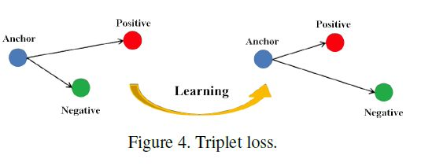

论文[Person Re-Identification by Multi-Channel Parts-Based CNN with Improved Triplet Loss Function](https://www.cv-foundation.org/openaccess/content_cvpr_2016/papers/Cheng_Person_Re-Identification_by_CVPR_2016_paper.pdf)
认为原版的Triplet loss只考虑正负样本对之间的相对距离，而并没有考虑正样本对之间的绝对距离，为此提出改进三元组损失(Improved triplet loss)：

$$L _ { i } t = d _ { a , p } + \left( d _ { a , p } - d _ { a , n } + \alpha \right) _ { + }$$

公式添加$d _ { a , p }$项，保证网络不仅能够在特征空间把正负样本推开，也能保证正样本对之间的距离很近。

#### 构建过程

从训练数据集中随机选一个样本，该样本称为Anchor，然后再随机选取一个和Anchor(记为x_a)属于同一类的样本和不同类的样本,这两个样本对应的称为Positive (记为x_p)和Negative (记为x_n)，由此构成一个（Anchor，Positive，Negative）三元组.

学习的目的即是：在一定的间隔alpha下，保证当前样本与同类样本之间的距离（distance_pos）与alpha之和小于其与非同类样本之间的距离（distance_neg）。(这样loss才会往小的方向变化)。

三元组的选择比较困难，如果暴力搜索查找整个集合里面的最近和最远样本，将非常耗时，且网络容易受不好的anchor影响不好训练，解决方式是在mini-batch里面进行选取。

#### triplet loss训练

Training of triplet loss requires carefully designed sampling of triplets 
A triplet consists of an anchor image $x _ { i } ^ { a }$ , a positive image $x _ { i } ^ { p }$ of the same person as the anchor and a negative image $x _ { i } ^ { n }$ of a different person. Triplet loss aims to learn a feature embedding so that $x _ { i } ^ { a }$ is closer to $x _ { i } ^ { p }$ than it is to  $x _ { i } ^ { n }$ in the embedding space. It can be formulated as follows:

$$\begin{aligned} \mathcal { L } _ { 0 } & = \sum _ { i } ^ { N } \left[ d _ { 0 } ^ { a p } - d _ { 0 } ^ { a n } + m _ { 0 } \right] _ { + } \\ d _ { 0 } ^ { a p } & = \left\| f _ { 0 } \left( x _ { i } ^ { a } \right) - f _ { 0 } \left( x _ { i } ^ { p } \right) \right\| _ { 2 } ^ { 2 } \\ d _ { 0 } ^ { a n } & = \left\| f _ { 0 } \left( x _ { i } ^ { a } \right) - f _ { 0 } \left( x _ { i } ^ { n } \right) \right\| _ { 2 } ^ { 2 } \end{aligned}$$

where $[ \cdot ] +$ is the hinge function. $d _ { 0 } ^ { a p }$ and $d _ { 0 } ^ { a n }$ are the squared Euclidean distance between the anchor-positive and anchornegative pairs respectively. $m_{0}$ is the margin enforced between $d _ { 0 } ^ { a p }$ and $d _ { 0 } ^ { a n }$.
N is the number of triplets in a training batch. $f _ { 0 } \left( x _ { i } \right) \in \mathbb { R } ^ { d }$ denotes the d-dimensional feature embedding of $x_{i}$, Here we apply a subscript(下标) $0$ on $f$, $d$ and $m$ indicate the base feature vector, distance and margin respectively.

### 3.四元组损失(Quadruplet loss)

参考论文：[Beyond triplet loss: a deep quadruplet network for person re-identification](https://arxiv.org/abs/1704.01719)

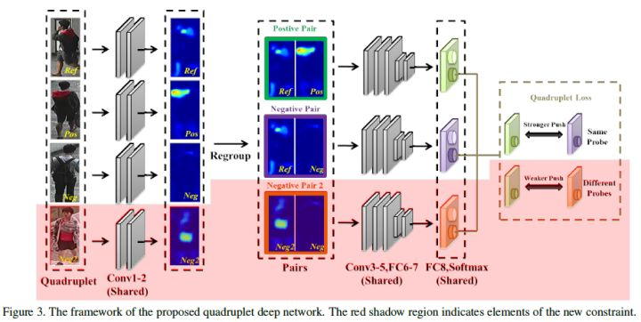

四元组损失是三元组损失的另一个改进版本。顾名思义，四元组(Quadruplet)需要四张输入图片，和三元组不同的是多了一张负样本图片。即四张图片为固定图片(Anchor) $a$，正样本图片(Positive) $p$,负样本图片1(Negative1)$n1$和负样本图片2(Negative2) $n2$。
其中$n1$和$n2$是两张不同行人ID的图片，其结构如上图所示。则四元组损失表示为：

$$q = \left( d _ { a , p } - d _ { a , n 1 } + \alpha \right) _ { + } + \left( d _ { a , p } - d _ { n 1 , n 2 } + \beta \right) _ { + }$$

其中$\alpha$和$\beta$是动设置的正常数，通常设置$\beta$小于$\alpha$，前一项称为强推动，后一项称为弱推动。相比于三元组损失只考虑正负样本间的相对距离，四元组添加的第二项不共享ID，所以考虑的是正负样本间的绝对距离。因此，四元组损失通常能让模型学习到更好的表征。

### 4.难样本采样三元组损失(Triplet loss with batch hard mining, TriHard loss)

参考论文：[In defense of the triplet loss for person reidentification](https://arxiv.org/abs/1703.07737)

难样采样三元组损失（本文之后用TriHard损失表示）是三元组损失的改进版。传统的三元组随机从训练数据中抽样三张图片，这样的做法虽然比较简单，但是抽样出来的大部分都是简单易区分的样本对。如果大量训练的样本对都是简单的样本对，那么这是不利于网络学习到更好的表征。大量论文发现用更难的样本去训练网络能够提高网络的泛化能力，而采样难样本对的方法很多。所以上面的论文提出了一种基于训练批量(Batch)的在线难样本采样方法——TriHard Loss。

TriHard损失的核心思想是：对于每一个训练batch，随机挑选$P$个ID的行人，每个行人随机挑选 $K$张不同的图片，即一个batch含有$PxK$张图片。之后对于batch中的每一张图片$a$，我们可以挑选一个最难的正样本和一个最难的负样本和$a$组成一个三元组。

严格来说，这是一种 local hard example mining，因为只是从一个batch中找的，不是从所有训练数据中找的。从所有数据中找的，可以参考下面说的那篇海康威视提出的Global Hard Identity Searching (GHIS)方法。

首先我们定义和$a$为相同ID的图片集为$A$,剩下不同ID的图片图片集为$B$,则TriHard损失表示为：

$$L _ { t h } = \frac { 1 } { P \times K } \sum _ { a \in b a t c h } \left( \max _ { p \in A } d _ { a , p } - \min _ { n \in B } d _ { a , n } + \alpha \right) _ { + }$$

其中 $\alpha$是人为设定的阈值参数。TriHard损失会计算$a$ 和batch中的每一张图片在特征空间的欧式距离，然后选出与$a$距离最远（最不像）的正样本$p$和距离最近（最像）的负样本$n$来计算三元组损失。通常TriHard损失效果比传统的三元组损失要好。

#### batch hard mining的问题：

Training of triplet loss requires sampling of triplets from all training images. The number of possible triplets grows cubically with the number of images in the training set. To train triplet loss efficiently, (Hermans, Beyer, and Leibe 2017) proposed batch hard triplet mining. Firstly, a batch of images is generated by randomly sampling P identities and K images per-identity. Then, for each sample in the batch, the hardest positive and negative samples within the batch are selected to form the triplets. It solves the impractical long training problem partially. However, sampling identities randomly may not ensure that negative pairs are hard enough. For instance, two persons with similar appearance may be dispersed to different batches so that there is no hard negative pair in one batch. 

为了解决上面说的问题，海康威视提出了一个 new identity sampling method called [Global Hard Identity Searching (GHIS)](https://arxiv.org/pdf/1812.06576.pdf)

### 5.边界挖掘损失(Margin sample mining loss, MSML)

边界样本挖掘损失(MSML)是一种引入难样本采样思想的度量学习方法。三元组损失只考虑了正负样本对之间的相对距离。为了引入正负样本对之间的绝对距离，四元组损失加入一张负样本组成了四元组$\left\{ a , p , n _ { 1 } , n _ { 2 } \right\}$。四元组损失也定义为：

$$L _ { q } = \left( d _ { a , p } - d _ { a , n 1 } + \alpha \right) _ { + } + \left( d _ { a , p } - d _ { n 1 , n 2 } + \beta \right) _ { + }$$

假如我们忽视参数$\alpha$和$\beta$的影响，我们可以用一种更加通用的形式表示四元组损失:

$$L _ { q ^ { \prime } } = \left( d _ { a , p } - d _ { m , n } + \alpha \right) _ { + }$$

其中 $m$和 $n$ 是一对负样本对，$m$和$a$既可以是一对正样本对也可以是一对负样本对。之后把TriHard loss的难样本挖掘思想引入进来，便可以得到：

$$L _ { m s m l } = \left( \max _ { a , p } d _ { a , p } - \min _ { m , n } d _ { m , n } + \alpha \right) _ { + }$$

其中$a , p , m , n$均是batch中的图片，$a , p$是batch中最不像的正样本对，$m , n$
是batch 中最像的负样本对，$a,m$皆可以是正样本对也可以是负样本对。概括而言TriHard损失是针对batch中的每一张图片都挑选了一个三元组，而MSML损失只挑选出最难的一个正样本对和最难的一个负样本对计算损失。所以MSML是比TriHard更难的一种难样本采样，此外$\max _ { a , p } d _ { a , p }$可以看作是正样本对距离的上界，$\min _ { m , n } d _ { m , n }$可以看作是负样本对的下界。MSML是为了把正负样本对的边界给推开，因此命名为边界样本挖掘损失。总的概括，MSML是同时兼顾相对距离和绝对距离并引入了难样本采样思想的度量学习方法。其演变思想如下图：

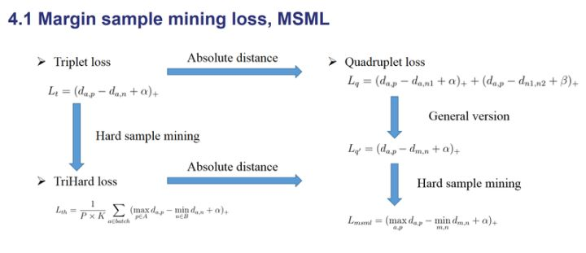

### 各种loss的性能对比

参考论文：[Margin Sample Mining Loss: A Deep Learning Based Method for Person Re-identification](https://arxiv.org/abs/1710.00478)

在上面这篇参考论文中，对上面提到的主要损失函数在尽可能公平的实验的条件下进行性能对比，实验结果如下表所示。作为一个参考：

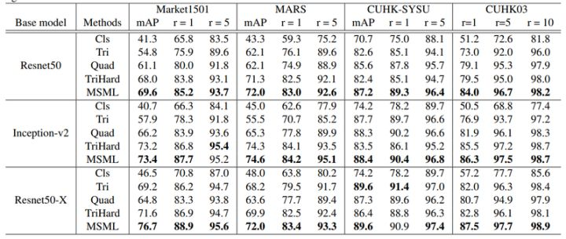

### 其他loss

#### 1.identification loss

identification loss就是classification loss，每一个人作为一个类别来训练分类问题，把某个全连接层作为feature来做reid，一般identification loss能很快收敛，但是面对百万级，千万级的数据稍显吃力。

Triplet loss was first introduced by (Weinberger and Saul 2009). It
directly optimizes a deep CNN which produces embeddings such that positive examples are closer to an anchor example than negative examples

For classification loss, each identity of person in the training set is considered as a class, and the network is trained to classify them correctly. Subsequently, the trained network is used as a feature extractor and a specific metric is chosen to rank the extracted features. In general, the performance of classification loss is superior over triplet loss, since it enforces global inter-class separability in the embedding space. However, as the number of identities increases, the number of learnable parameters grows. For scenarios with very large quantity of identities, it would be non-trivial to train a classification loss.

#### 2.verification loss

(其实主要是contrastive loss)

verification loss就是用两张图来做二分类，判断是否为同一个人，这个作为辅助训练还行，作为主训练的loss估计要崩。

verification loss is used to learn a cross-image representation. The
network predicts the similarity between two input images directly. During inference, all query-gallery image pairs need to go through the whole network, which is very expensive.

具体情况可以查看后面的链接。

# 数据集

[Person Re-identification Datasets](https://robustsystems.coe.neu.edu/sites/robustsystems.coe.neu.edu/files/systems/projectpages/reiddataset.html)

## 1.基于图片的数据集

|数据库 | 时间 | 行人 | 图片 | 相机 | views| scenario| 
| :---| :---| :--- | :--- | :--- |:--- |  :--- |    
|VIPeR | 2007 |632  |1264 |2     | 2|outdoor
|iLIDS |2009  |  119|  476|    2 | 2|indoor,airport|
|GRID|2009|250|1275|2|
|CAVIAR|2011|72|610|2|
|CUHK01|2012|971|3884|2|
|CUHK02|2013|1816|7264|10(5pairs)|2|outdoor,campus|
|CUHK03|2014|1467|13164|2|
|RAiD|2014|43|1264|4|
|PRID450S|2014|450|900|2|
|Market-1501|2015|1501|32668|6| |supermarket

views denotes the maximum number of camera views for the same person

### 数据集描述

#### VIPeR

VIPeR 数据集是行人重识别中使用最为普遍的 数据集，也是最具挑战性的数据集之一。VIPeR 基 于图像， 包含 632 个行人， 1 264 幅图片， 具有两个 相机视角，每个相机视角下包含一个行人的一副图片。 数据集中同一行人的两个相机下的成像视角差距较 大， 大部分在 90°以上。 数据集中所有的图像都归一化到相同的分辨率 128×48。

#### CUHK系列

CUHK01: 也是具有较高的挑战性的数据集。 该数据集包含 3 884 幅图像，971 个行人。每个行人 对应从两个相机视角拍摄的 4 幅图像，view A 主要捕获人的正面和背面，view B捕获侧面，每个相机 2 幅。 所有图像分辨率均归一化到 160×60。

CUHK02: 取自5个不同的户外camera对，共1816人。5个camera对分别有971,306,107,193,239人，大小160*60. 每个人在每个摄像机下的不同时间内取两张图片。大多数人都有负重（背包，手提包，皮带包，行李）。 

CUHK03: 该数据集在香港中文大学内采集，图像来自2个不同摄像头。该数据集提供 机器检测和手工检测两个数据集。 其中检测数据集包含一些检测误差，更接近实际情况。平均每个人有9.6张训练数据。

#### Market-1501

Market-1501 数据集包含 1501 个行人，超过 30000 幅图像，视频图像来源于6个摄像机,使用了6个摄像头，5个高分辨率的，1个低分辨率的，不同的摄像头存在重叠(Overlap exists among different cameras)。同时该数据集提供训练集和测试集。 训练集包含12936张图像，测试集包含19732张图像。图像由检测器自动检测并切割，包含一些检测误差（接近实际使用情况）。训练数据中一共有751人，测试集中有750人。所以在训练集中，平均每类（每个人）有17.2张训练数据。

## 2.基于视频的数据集

|数据库|时间|行人数|相机数|
| :--| :--| :--| :--|
|ETHZ|2007|85|1|
|3DPES|2011|192|8|
|PRID2011|2011|200|2|
|iLIDS-VID|2014|300|2|
|MARS|2016|1261|6|

### 数据集描述

iLIDS-VID 数据集也是基于视频情况下的行人重识别最为常用的数据集之一。 该数据集包含 319 个行人。 每个视频序列包含 23~192 个行人图 像，平均帧数为 73 帧。由于该数据集在一个机场大 厅拍摄， 很多行人的外观特征比较接近， 两个摄像 机的成像效果比较差，成像视角和光照强度都存在 较大差异， 每个图像中存在遮挡等不少干扰信息， 因此是很有挑战性的数据集，见下图：

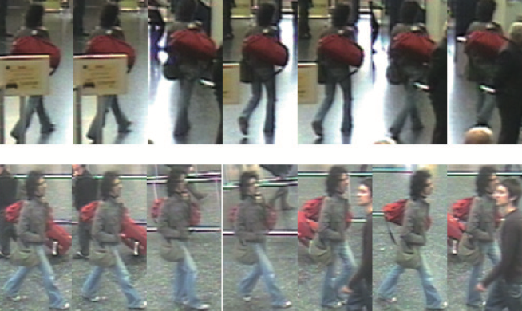

PRID2011 数据集也是基于视频的情况下行 人重识别最为常用的数据集之一。该数据集由两个 摄像机拍摄， cam_a 视角下有 385 组行人序列， cam_b 视角下有749组行人序列，其中两个视角下有200个行人相同，每个视频序列包含5-675 帧图 像，平均帧数100。与 iLIDS-VID 不同的是，该数据集的背景比较干净，图像中较少存在遮挡这种干扰信息， 图像的成像效果比较好。 和 iLIDS-VID 类 似，两个摄像机成像视角和光照强度也存在很大的 差异，如下图：

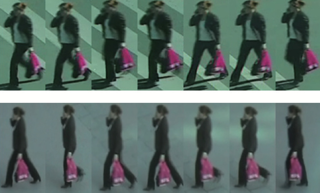

# 参考链接

1.[open-reid](https://github.com/Cysu/open-reid)

2.[基于深度学习的行人重识别研究综述](https://zhuanlan.zhihu.com/p/31921944)

3.[有没有行人检测再识别完整源代码？](https://www.zhihu.com/question/46943328)

4.[人脸识别的LOSS（上）](https://zhuanlan.zhihu.com/p/34404607)

5.[人脸识别的LOSS（下）](https://zhuanlan.zhihu.com/p/34436551)

6.[行人重识别综述：从哈利波特地图说起](https://zhuanlan.zhihu.com/p/26168232)

# to do

- [ ] loss 函数整合两篇文章
- [ ] market 1501 desrible
